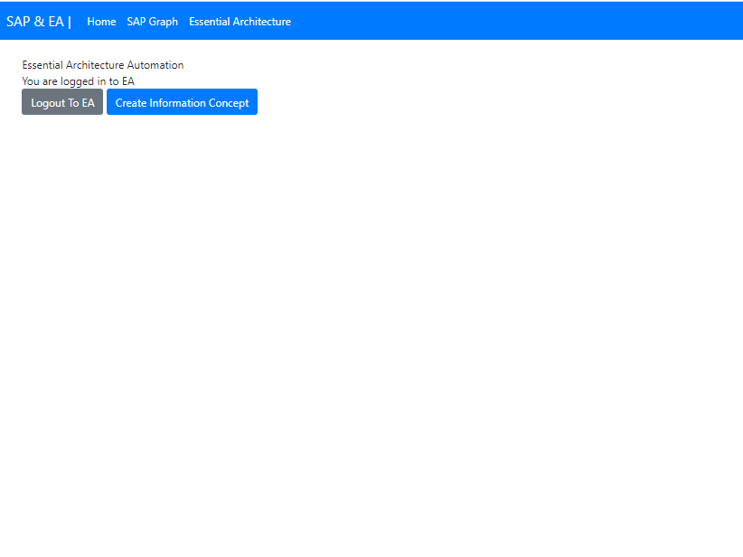

# integrating-sap-graph-and-essential-dissertation

The project is to connect with SAP Graph and using the returned metadata to capture data and visualize in Essential Architecture. 

Right now, using the Link Enterprise Data framework, the application can be used to see graphical representation of entites, and also queries to get the linked data. Since, enterprise architecture "Data Management" and "Application Portfolio Management" is not available to explore, essential provides "Information and Data", to leverage its power, Data Object can be used, for this Generalization and Specialization is needed, but we need to mine the attributes to extract useful information. Therefore we need to perform some machine learning, data mining techniques.

### Project Structure
1. web - Automation for browser based application to connect to SAP Graph, visualize the entities and EA for capture and views
2. cli - Currently in progress but provides the command-line tool to automate the process
3. domain - The common business logic contains in this folder
4. data - The extracted data are put into this folder, since fetching all the entities from SAP Graph is slow

### Features
#### Web
1. Using SAP Graph we can sync all the entities to our data/ folder
2. Using SAP Graph we can push the entities data into Neo4J databases for later queries and visualization
3. Using SAP Graph we can provide the name of the Entity and it will return the relatship with it
4. Using Essential Architecture API we can login to the EA
5. Using Essential Architecture API we can capture data for Information layer - It will publish data to EA
6. TODO Using Essential Architecture API we want to push data into Data Object and Data Object Attribute for automation
#### Cli
TODO

### Getting Started
To run the application we need to install Python and the required dependency `django`
1. If running first time need to run migrate script (for session management) `python manage.py web/migrate`
2. Running the server `python manage.py runserver`
3. Go to browser and enter http://localhost:8000

### Screenshots

When click on the SAP Graph and Login to your SAP Graph. Search for Entity for their relationship or Click on "Load Graph Network". This will display the entities with relationships on the Graph

We click on the Essential Architecture, we can login by providing the username, password and API Key provided by Essentail Architecture. Then Using the button we will be able to create the "Information Concept", "Business Domain", "Information Domain", and "Information View". This data captured can be seen in the Essentail Architecture portal.

### Future Work (Currently Looking)

We are working on "Data Object" and "Data Object Attribute", which will capture data provided by the SAP Graph API. These data can be then visualized using Essentail Architecture viewer.

Future works also includes applying machine learning alogrithms for identifying common attributes for generalization and Specialization. Using the generated data by the algorithm, it could be forward to the Essential Architecture to create a effective views.

Following are the list needed to investigate, if these are algorithms are useful for the application.

##### For Attribute Clustering or Similarity Analysis:
- K-means clustering
- Hierarchical clustering
- DBSCAN (Density-Based Spatial Clustering of Applications with Noise)
- Spectral clustering
- Affinity propagation
- Cosine similarity
- Jaccard similarity
- Euclidean distance-based similarity measures

##### For Rule-Based Classification or Pattern Matching:
- Decision Trees (e.g., ID3, C4.5, CART)
- Random Forests
- Gradient Boosting (e.g., XGBoost, LightGBM)
- Association Rule Mining (e.g., Apriori, FP-Growth)
- Naive Bayes Classifier
- Support Vector Machines (SVM)
- Neural Networks (e.g., Multi-layer Perceptron)
- Rule Induction algorithms (e.g., RIPPER, C5.0)

##### For Graph-based Techniques:
- Network clustering algorithms (e.g., Louvain, Girvan-Newman)
- Community detection algorithms (e.g., Modularity-based methods, Label Propagation)
- PageRank algorithm
- Graph embedding techniques (e.g., node2vec, GraphSAGE)
- Graph neural networks (GNNs)
- Graph pattern mining algorithms